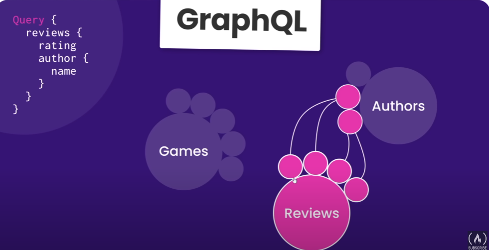

## GraphQL course for Beginners ##

- this note is meant to be an overview and not a guide -

=> https://www.youtube.com/watch?v=5199E50O7SI<=

# what is graphQL #

Is a query language, specific syntax to request and mutate date 
Alternative to using REST API

> REST API looks like:

- pokemonsite.com/api/pokemon
- pokemonsite.com/api/pokemon/12
 
 const
 when we have a larger application, the back and forth with REST api will cause overfetching which is why GraphQL was created

> GraphQL looks like:

Singel Endpoint
mygraphwlsite.com/graphql

query{
    course{
        id,
        title,
        author{
            name,
            id,
            courses{
                id,
                title,
                thumbnai_url
            }
        }
    }
}

all made on a single request, instead of multiple request with REST APIs.

# Query Basics

query ReviewsQuery{
    reviews{
        rating,
        content,
        id
    }
}

we get graph that are basically connections between data for different sources just like this  .

# Making a GraphQL server with Apollo

link to official docs => https://www.apollographql.com/docs/apollo-server/getting-started

Apollo waits for an object as an argument

Schema defines the data

# Resolver Functions# GraphQL-FReeCodeCamp
